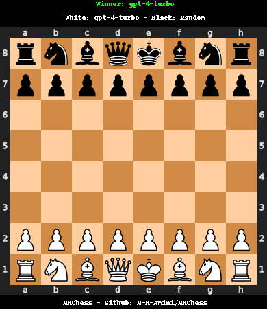

# Can LLMs Play Chess? 

<p align="center">
  
  
</p>

This repository explores whether current large language models (LLMs) are capable of planning in a zero-shot setting by engaging them in chess games against a random agent. This project includes various LLMs like GPT3.5, GPT4, Llama2, Llama3, Gemma, Mistral, and Flan-T5.

## Getting Started

To get started with running these tests, execute the following steps:

```bash
./docker.sh     # Sets up the Docker environment
python mh_fixture.py  # Runs the test fixture
```

### Output

All outputs from the games, including logs and stats, are stored in the `output` folder.

## Game Statistics

Below is a table summarizing the performance of each LLM against the random agent across five games:

| LLM          | Wins  | Losses | Draws | Invalid Outputs |
|--------------|-------|--------|-------|-----------------|
| GPT4-Turbo   | 1     | 0      | 4     | 0               |
| Mistral      | 1     | 1      | 3     | 43              |
| GPT3.5       | 0     | 1      | 4     | 4               |
| Llama2-7b    | 0     | 1      | 4     | 11              |
| Llama2-70b   | 0     | 1      | 4     | 16              |
| Llama3-7b    | 0     | 0      | 5     | 17              |
| Gemma        | 0     | 1      | 4     | 0               |
| Flan-T5-base | 0     | 2      | 3     | 0               |
| Flan-T5-large| 0     | 1      | 4     | 1               |
| Flan-T5-xl   | 0     | 0      | 5     | 0               |
| Flan-T5-xxl  | 0     | 0      | 5     | 0               |

## Further Exploration

This project is not currently active, but potential areas for future research include:
- Conducting matches between different LLMs.
- Fine-tuning LLMs using expert chess datasets to observe any improvements.

Feel free to fork this repository, explore the existing data, add your experiments, and share your findings!

